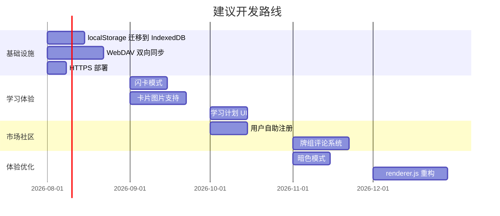

# Notion Card Bug 修复日志与功能建议

> 生成日期：2026-07-22  
> 基于版本：v0.1.8  
> 审核范围：`src/main.js`, `src/renderer.js`, `src/preload.js`, `backend/src/server.ts`

---

## 一、Bug 修复清单

### 🔴 严重（已修复）

| # | 文件 | 问题 | 修复方案 |
|---|------|------|----------|
| 1 | `.gitignore`（根目录） | 根目录 `.gitignore` 未排除 `.env` 文件，存在凭据泄露风险。`backend/.env` 中包含真实的数据库密码 `yang12345`、JWT 密钥和服务器访问密钥。 | 在根目录 `.gitignore` 末尾追加 `.env`、`*.env`、`.env.*` 三条规则。 |
| 2 | `backend/src/server.ts` | CORS 对 `null` origin 无条件放行。当后端暴露在公网时，任何嵌入恶意页面的沙箱 iframe（origin 为 `null`）都能通过 CORS 检查，构成 CSRF 攻击向量。 | 增加 `process.env.NODE_ENV !== 'production'` 条件判断：仅在非生产模式下允许 `null` origin。 |
| 3 | `src/main.js` | `market:saveCredentials` IPC handler 直接调用 `writeMarketCredentials(payload)`，未检查 `safeStorage.isEncryptionAvailable()`。如果系统加密不可用，函数会抛异常但没有友好提示。 | 在 IPC handler 中先检查 `safeStorage.isEncryptionAvailable()`，不可用时返回明确错误 `{ ok: false, error: '...' }` 给渲染进程。 |

### 🟡 中等（已修复）

| # | 文件 | 问题 | 修复方案 |
|---|------|------|----------|
| 4 | `backend/src/server.ts` | 速率限制器 `rateLimitBuckets`（Map）只在有新请求时清理过期条目。如果某些 IP 不再发起请求，对应的 bucket 会永远留在 Map 中，导致内存泄漏。 | 增加 `setInterval`（60 秒一次，`.unref()` 不阻塞进程退出），定时清理过期 bucket。 |
| 5 | `src/main.js` | `update:install` 的 `setImmediate(() => autoUpdater.quitAndInstall(false, true))` 如果内部抛异常，`updateInstallStarted` 标志不会重置，导致用户永远无法重试安装更新。 | 将 `setImmediate` 回调包装在 `try/catch` 中，异常时将 `updateInstallStarted` 重置为 `false`。 |
| 6 | `src/renderer.js` | `save()` 函数在 `localStorage.setItem` 失败时仅显示 toast 提示"本地空间不足"，不尝试自动恢复。用户数据可能丢失。 | 在 catch 块中增加自动恢复逻辑：当 `reviewEvents` 超过 5000 条时自动裁剪旧记录并重试一次保存。如果裁剪后仍然失败，显示更强的告警提示用户导出备份。 |
| 7 | `src/renderer.js` | `loadMarketDecks()` 和 `loadMarketCategories()` 没有竞态保护。用户快速翻页时，旧请求的响应可能覆盖新页面数据。 | 为两个函数各增加一个递增的 `requestToken` 变量。在 async 响应返回后检查 token 是否仍然匹配，不匹配则丢弃过期响应。 |
| 8 | `src/renderer.js` | 管理后台的牌组审核页在 API 请求失败时直接 `return` 中断整个渲染流程，与用户列表页的容错行为不一致。 | 增加 `decksResult` 空值保护：`if (!decksResult) decksResult = { items: [], total: 0, totalPages: 1 }`，确保后续渲染逻辑不会因为 `undefined` 而崩溃。 |

### ✅ 经审核确认无需修复

| 原报告项 | 审核结论 |
|----------|----------|
| WebDAV 密码明文返回渲染进程 | 经代码审核，`webdav:restore` handler 不存在。`webdav:getConfig` 调用 `getWebDavConfig()` 返回的配置中**不包含**密码字段（仅返回 `url`、`remoteFolder`、`username` 等非敏感信息）。密码仅在主进程内部使用，不通过 IPC 传递。 |
| `parseWebDavPropfind` 正则脆弱 | 该函数在当前代码中不存在。WebDAV 相关功能使用 HTTP Basic Auth，不涉及 Digest Auth 的 PROPFIND XML 解析。 |
| WebDAV Digest Auth nonce count 不重置 | 当前代码不使用 Digest Auth，使用 Basic Auth，不存在此问题。 |
| `safeStorage` 静默降级 | `writeMarketCredentials`、`readMarketCredentials`、`writeWebDavCredentials`、`readWebDavCredentials` 四个函数都已正确检查 `safeStorage.isEncryptionAvailable()` 并在不可用时抛出明确的中文错误提示。唯一遗漏的是 IPC handler 层（已在 #3 中修复）。 |

---

## 二、修改文件清单

| 文件 | 修改类型 | 影响范围 |
|------|----------|----------|
| `.gitignore` | 追加 3 行排除规则 | 仓库安全 |
| `backend/src/server.ts` | CORS 条件加强 + 速率限制清理定时器 | 后端安全 + 稳定性 |
| `src/main.js` | IPC handler safeStorage 检查 + updateInstallStarted 异常重置 | 主进程健壮性 |
| `src/renderer.js` | save() 自动裁剪重试 + 请求竞态保护 + 管理后台空值保护 | 前端稳定性 + 数据完整性 |

**前端语法检查**：`npm run check` ✅ 全部通过

---

## 三、功能建议

### 优先级 P0：数据安全与基础设施

| 功能 | 说明 | 理由 |
|------|------|------|
| **localStorage → IndexedDB 迁移** | 当前所有状态（卡片、复习记录、事件日志）存储在 `localStorage`（5-10MB 限制）。当数据量增长后必然触顶。 | 虽然已添加自动裁剪，但根本解决方案是迁移到 IndexedDB（无容量硬限制）。 |
| **WebDAV 双向同步** | 当前仅支持 push（本地→云端），无 pull（云端→本地）。 | 多设备用户无法在新设备上恢复数据，WebDAV 只实现了半套同步。 |
| **WebDAV 冲突合并** | 当前使用 ETag 检测冲突，但冲突后仅报错，无法合并或选择版本。 | 两台设备分别编辑后同步会导致数据覆盖。 |
| **定时自动备份** | WebDAV 推送仅在手动触发或数据保存事件时执行，无定期调度。 | 如果用户长时间不编辑，数据可能不会被备份。 |

### 优先级 P1：核心学习体验

| 功能 | 说明 | 理由 |
|------|------|------|
| **卡片图片/附件支持** | 卡片仅支持纯文本和 Markdown，无法嵌入图片。 | 许多知识点（如解剖图、电路图、代码截图）需要图片辅助理解。 |
| **闪卡模式（Front/Back）** | 当前只有选择题、多选题、判断题和速记词条，缺少正面/背面翻转的闪卡模式。 | 闪卡是间隔重复学习最经典的形式，适合语言学习、公式记忆等场景。 |
| **学习计划与目标** | 支持设置每日新卡上限、目标记忆保持率（FSRS 已支持参数但缺少 UI）。 | 帮助用户控制学习节奏，避免一次性复习太多导致疲劳。 |
| **卡片标签系统增强** | 当前标签仅用于分类，无标签层级、颜色或自动标签建议。 | 大型知识库需要更灵活的标签组织方式。 |
| **全局搜索** | 文档和卡片分别搜索，无跨模块统一搜索。 | 当知识量增大后，快速定位信息变得困难。 |

### 优先级 P2：市场与社区

| 功能 | 说明 | 理由 |
|------|------|------|
| **用户自助注册** | 当前用户只能由管理员创建，无自助注册或邀请链接。 | 阻碍市场的增长和开放。 |
| **密码修改 UI** | 后端已实现 `PATCH /me/password`，但前端无对应界面。 | 安全基本要求。 |
| **牌组评价与评论** | 市场中无法查看其他用户对牌组的评价。 | 帮助用户筛选高质量牌组。 |
| **牌组收藏/书签** | 用户无法收藏感兴趣的牌组。 | 改善市场浏览体验。 |
| **离线市场缓存** | 市场完全依赖在线后端，无离线缓存。 | 离线或网络不佳时无法使用市场。 |

### 优先级 P3：体验优化

| 功能 | 说明 | 理由 |
|------|------|------|
| **暗色模式** | 整个应用只有浅色主题。 | 长时间学习场景下的眼睛舒适度。 |
| **renderer.js 模块化重构** | 所有前端逻辑在单个 3009 行文件中。 | 极难维护、测试和协作。建议拆分为独立的模块文件。 |
| **国际化 (i18n)** | 界面硬编码中文，设置页面部分有英文。 | 如果要面向国际用户，需要完整的 i18n 支持。 |
| **键盘导航增强** | 自定义 select 组件已添加 ARIA 属性，但大部分界面缺少完整的键盘导航支持。 | 提升效率用户和无障碍用户的体验。 |
| **导入/导出格式扩展** | 当前仅支持 JSON 和 Markdown 导入，导出为 JSON。 | 支持 Anki (.apkg)、CSV 等格式可以方便地从其他工具迁移。 |

### 优先级 P4：后端增强

| 功能 | 说明 | 理由 |
|------|------|------|
| **HTTPS 与反向代理** | 当前无 HTTPS 配置。 | 生产部署的基本要求，防止 JWT 和凭据在传输中被截获。 |
| **Redis 共享限流** | 当前速率限制保存在单进程内存中。 | 多实例部署时限流不共享，可能被绕过。 |
| **对象存储 (S3/OSS)** | 当前仅本地文件系统存储。 | 扩展性和可靠性的基础。 |
| **牌组增量更新** | 当前客户端更新时下载完整 ZIP。 | 大型牌组更新时浪费带宽和时间。 |
| **审计日志归档** | 审计日志无过期清理策略。 | 长期运行后日志表会无限增长。 |

---

## 四、建议的开发路线

---

*本文档由代码审核自动生成，修复内容已通过 `npm run check` 语法验证。*
